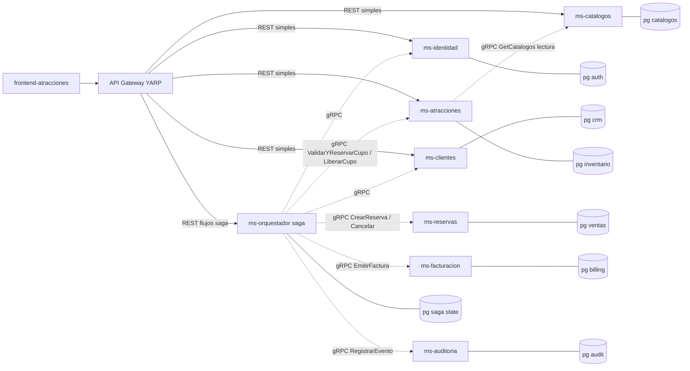

# Contexto del proyecto (Cursor Agent)

Este archivo resume el **plan de migración** acordado para el repositorio **Atracciones**. Cursor lo usa como contexto en chats nuevos. La visión de dominio original está en [MicroservicioAtracionesAPI/docs/arquitectura_microservicios.md](MicroservicioAtracionesAPI/docs/arquitectura_microservicios.md). La variante implementada aquí **no usa RabbitMQ**: integración **síncrona vía gRPC** y **ms-orquestador** (sagas con compensación).

## Checklist de fases (Strangler Fig)

- [x] **Fase 0:** docker-compose (gateway + Jaeger), BuildingBlocks (correlation + idempotency stub; Polly en fases posteriores), API Gateway YARP al monolito; frontend vía gateway y `X-Correlation-ID`.
- [x] **Fase 1:** `ms-identidad` (login, JWT RS256, JWKS, gRPC `UsuarioService`, espejo interno); registro sigue en monolito + sync a `auth.*`; ETL SQL en `services/ms-identidad/db/`; gateway enruta solo `POST /api/v1/auth/login` a identidad.
- [x] **Fase 2:** `ms-clientes` (perfil REST vía gateway, gRPC `ClienteService`, mirror HTTP tras alta/edición en monolito, ETL `crm.clientes`).
- [x] **Fase 3:** extraer `ms-catalogos` (destinos/categorías/idiomas/incluye/imágenes, gRPC `CatalogoService`).
- [x] **Fase 4:** extraer `ms-atracciones` (inventario + tickets/horarios; gRPC a catálogos + `ValidarYReservarCupo` / `LiberarCupo`; REST público/admin vía gateway). **Pendiente opcional:** exponer reseñas (`Resenas*`) en este servicio y retirar rutas duplicadas del monolito cuando el ETL esté validado.
- [x] **Fase 5:** crear `ms-orquestador` (sagas) + extraer `ms-reservas`; orquestación gRPC con compensaciones.
- [x] **Fase 6:** extraer `ms-facturacion` (gRPC `EmitirFactura` llamado por orquestador).
- [x] **Fase 7:** `ms-auditoria` (gRPC `RegistrarEvento`), OTel hacia Jaeger (gateway + orquestador + auditoría), correlación e idempotencia en gateway/frontend. *Pendiente operativo:* mTLS/B2B opcional, apagar monolito cuando todas las rutas estén migradas.

---

# Migración completa a microservicios (Strangler Fig)

## 1. Estado de partida vs objetivo

Hoy el repositorio es un monolito 4 capas con un único `DbContext`/proyecto API; los repositorios y servicios cruzan libremente todos los Bounded Contexts (BC). Resumen del análisis sobre [`MicroservicioAtracionesAPI/`](MicroservicioAtracionesAPI/):

- **Proyectos en cadena:** [`Microservicio.Atracciones.Api`](MicroservicioAtracionesAPI/Microservicio.Atracciones.Api/) → [`Business`](MicroservicioAtracionesAPI/Microservicio.Atracciones.Business/) → [`DataManagement`](MicroservicioAtracionesAPI/Microservicio.Atracciones.DataManagement/) → [`DataAccess`](MicroservicioAtracionesAPI/Microservicio.Atracciones.DataAccess/).
- **22 entidades** en 7 carpetas: `Atracciones`, `Auditoria`, `Catalogos`, `Clientes`, `Facturacion`, `Reservas`, `Seguridad`.
- **17 controladores V1** (Internal/Booking/Auth) bajo `api/v1/...`.
- **JOINs y FKs cross-context que rompen los BC del .md** (deben sustituirse por GUIDs sin FK + gRPC orquestado):
  - `Cliente` 1–1 `Usuario` ([`ClienteConfiguration.cs`](MicroservicioAtracionesAPI/Microservicio.Atracciones.DataAccess/Configurations/ClienteConfiguration.cs))
  - `Reserva` → `Cliente`/`Horario` ([`ReservaConfiguration.cs`](MicroservicioAtracionesAPI/Microservicio.Atracciones.DataAccess/Configurations/ReservaConfiguration.cs))
  - `Ticket` → `Atraccion` ([`TicketConfiguration.cs`](MicroservicioAtracionesAPI/Microservicio.Atracciones.DataAccess/Configurations/TicketConfiguration.cs))
  - `Atraccion` → `Destino`/`Categoria`/`Idioma`/`Incluye` ([`AtraccionConfiguration.cs`](MicroservicioAtracionesAPI/Microservicio.Atracciones.DataAccess/Configurations/AtraccionConfiguration.cs))
  - `Factura` 1–1 `Reserva` + `DatosFacturacion` ([`FacturaConfiguration.cs`](MicroservicioAtracionesAPI/Microservicio.Atracciones.DataAccess/Configurations/FacturaConfiguration.cs))
  - `Resenia` → `Atraccion`/`Reserva` ([`ReseniaConfiguration.cs`](MicroservicioAtracionesAPI/Microservicio.Atracciones.DataAccess/Configurations/ReseniaConfiguration.cs))
- **Servicios “orquestadores” cross-context:** `ReservaPublicService` y `ReseniaPublicService` ([`Business/Services/Public/`](MicroservicioAtracionesAPI/Microservicio.Atracciones.Business/Services/Public/)) inyectan 4–5 `IDataService` de BC distintos; `FacturaPublicService` también. El perfil de cliente expuesto al navegador lo sirve **`ms-clientes`** (`GET`/`PUT /api/v1/clientes/perfil`).
- **No existe nada de:** gRPC, Polly, `IHttpClientFactory`, `Idempotency-Key`, `X-Correlation-ID` ni servicios separados (es un solo proceso).

## 2. Arquitectura objetivo

El **middleware orquestador** (`ms-orquestador`) es un microservicio propio en .NET 10 con las 4 capas Clean Architecture (Api / Business / DataManagement / DataAccess). No hay bus de eventos: toda la integración entre servicios es **síncrona vía gRPC** y los flujos multi-paso (reservas, pago, factura) se implementan como **saga orquestada con compensaciones explícitas**. La auditoría se invoca con un gRPC dedicado, no por suscripción.



## 3. Stack y decisiones técnicas

- **API Gateway:** YARP en .NET 10 con rutas por prefijo. CRUDs simples van directo al microservicio dueño; los **flujos saga** (`/api/v1/reservas/**`, registro completo de cliente, confirmar pago, cancelar) van al **orquestador**. CORS centralizado, `X-Correlation-ID` autogenerado, rate limiting básico, validación local de JWT.
- **ms-orquestador (Middleware orquestador, Clean Architecture 4 capas):**
  - **Api:** controladores REST que reciben los flujos compuestos (`POST /reservas`, `POST /reservas/{guid}/confirmar-pago`, `PUT /reservas/{guid}/cancelar`, `POST /auth/registro` orquestado).
  - **Business:** **Use Cases / Sagas** con pasos `Try / Confirm / Compensate`. Una clase `SagaCrearReserva`, `SagaConfirmarPago`, `SagaCancelarReserva`, `SagaRegistroCliente`.
  - **DataManagement:** Unit of Work local + repositorio del **estado de saga** (`saga_state`, `saga_pasos`, `idempotency_keys`).
  - **DataAccess:** EF Core Postgres propio para persistir el estado de saga e idempotencia; **clientes gRPC** generados a partir de los `.proto` compartidos.
- **gRPC:** Contratos `.proto` en proyecto compartido `Contracts.Protos`. Cada microservicio expone un `*Service.proto` (p. ej. `UsuarioService`, `ClienteService`, `AtraccionInventarioService`, `ReservaService`, `FacturaService`, `AuditoriaService`). El orquestador es **cliente** de todos; ningún microservicio llama a otro salvo la lectura `ms-atracciones → ms-catalogos`.
- **Compensaciones explícitas (saga síncrona):** si un paso falla, el orquestador llama a la operación inversa de los pasos previos (`LiberarCupo`, `AnularReservaPendiente`, etc.) y deja la saga en estado `COMPENSADA`. Cada paso registra resultado en `saga_pasos`.
- **Idempotencia:** header `Idempotency-Key` obligatorio en POST de orquestador (reserva, pago). Tabla `idempotency_keys (key PK, response_hash, fecha)` en BD del orquestador. Si llega la misma clave con mismo body, devuelve la respuesta original sin reejecutar la saga.
- **JWT:** RS256 emitido por `ms-identidad`. Demás servicios validan **localmente** con la clave pública (JWKS expuesto por `ms-identidad`). Claims clave: `sub = usu_guid`, `roles`. El orquestador propaga el JWT en el metadata gRPC (`Authorization: Bearer …`).
- **Persistencia:** Postgres en Railway, **una BD por servicio** (incluido el orquestador). En Railway puede ser una sola instancia con bases distintas si el plan no admite varias instancias; no se comparten esquemas entre servicios.
- **Migraciones:** EF Core Migrations por servicio (sin `EnsureCreated`); cada servicio aplica las suyas en arranque controlado.
- **Observabilidad:** OpenTelemetry (traces/logs/metrics) → exportador OTLP (Jaeger local; Grafana Cloud u otro en producción). Serilog estructurado; `correlation_id` se propaga por header HTTP y metadata gRPC y queda en cada `saga_pasos`.
- **Resiliencia gRPC:** Polly v8 sobre cada cliente gRPC: timeout 2s, retry 2 (solo en `UNAVAILABLE` / `DEADLINE_EXCEEDED`), circuit breaker. Si un dependiente cae en pleno flujo, la saga compensa los pasos ya ejecutados.
- **Sin RabbitMQ ni outbox.** No hay eventos. Cualquier necesidad “asíncrona” (auditar, notificar) se modela como una **llamada gRPC adicional** desde el orquestador, opcionalmente disparada en `Task.Run` con su propio circuit breaker si no debe bloquear la respuesta al cliente.
- **Secretos:** `dotnet user-secrets` en local; variables de entorno en Railway; **no** versionar `appsettings.*.json` con datos reales.
- **Despliegue local:** `docker-compose.yml` en `platform/` con: gateway, orquestador, los microservicios extraídos (incl. facturación) y un Postgres por servicio + Jaeger. Sin Rabbit.

## 4. Nueva estructura del repositorio (monorepo poliservicio)

```text
Atracciones/
├── frontend-atracciones/                  (sin moverse, solo cambia VITE_API_URL al gateway)
├── platform/
│   ├── docker-compose.yml
│   ├── gateway/                           YARP gateway
│   └── shared/
│       ├── Contracts.Protos/              .proto compartidos (UsuarioService, ClienteService,
│       │                                   AtraccionInventarioService, ReservaService,
│       │                                   FacturaService, AuditoriaService)
│       └── BuildingBlocks/                Idempotency, Correlation, OTel ext, Polly policies,
│                                           gRPC client factory.
├── services/
│   ├── ms-orquestador/    (Api, Business[Sagas], DataManagement[SagaState], DataAccess)
│   ├── ms-identidad/      (Api, Business, DataManagement, DataAccess)
│   ├── ms-clientes/
│   ├── ms-catalogos/
│   ├── ms-atracciones/
│   ├── ms-reservas/
│   ├── ms-facturacion/                    (`billing.*`, gRPC FacturaService, REST lecturas)
│   └── ms-auditoria/                      (`audit.eventos` append-only, gRPC AuditoriaService)
└── MicroservicioAtracionesAPI/            queda como “monolito legacy” durante la migración
```

Cada `services/ms-*/` repite la estructura 4 capas que ya conoce el equipo. El orquestador en su capa **Business** alberga las **Sagas** y los **Use Cases** que encapsulan los flujos compuestos.

## 5. Reglas para todos los servicios

- **Sin FKs entre servicios.** Solo se guardan GUIDs (`usu_guid`, `cli_guid`, `atr_guid`, `tck_guid`, `hor_guid`, `rev_guid`).
- `cli_guid` = `usu_guid` (alineado con el .md, evita lookup adicional al registrar cliente).
- **Cada microservicio expone sus operaciones de mutación tanto en REST como en gRPC** (REST para clientes externos cuando aplica, gRPC para el orquestador). Los CRUDs simples siguen siendo REST puros.
- **Toda mutación multi-servicio pasa por el orquestador.** Los microservicios no se llaman entre sí salvo lecturas claramente declaradas (caso explícito autorizado: `ms-atracciones → ms-catalogos` para enriquecer respuestas).
- **Toda operación gRPC del orquestador es idempotente** o tiene una contraparte de compensación (`Liberar*`, `Anular*`, `Revertir*`).
- Toda llamada gRPC: timeout 2s + retry 2 + circuit breaker; si falla, dispara compensación de pasos previos.
- **Persistencia del estado de saga:** `saga_state(saga_id, tipo, estado, fecha_inicio, fecha_fin)` y `saga_pasos(saga_id, paso, estado, request_payload, response_payload, error)` en BD del orquestador para auditoría/reanudación manual.

## 6. Plan de migración por fases (Strangler Fig)

Cada fase termina con el sistema **funcionando end-to-end** desde el frontend a través del gateway.

### Fase 0 — Cimientos (sin tocar el monolito)

- Crear carpeta `platform/` con:
  - `docker-compose.yml`: **gateway** + **Jaeger** (OTLP). Postgres por servicio se añade al aparecer `services/ms-*`. **Sin RabbitMQ.**
  - `gateway/`: YARP enrutando **`/api/**`** (incluye `/api/v1/**`) al monolito existente.
  - `shared/BuildingBlocks/`: middleware `X-Correlation-ID`, OpenTelemetry en el gateway, stub de idempotencia; Polly + fábrica gRPC en fases siguientes.
  - `shared/Contracts.Protos/`: estructura inicial + script placeholder de generación.
- Cambiar `VITE_API_URL` del frontend al gateway: `http://localhost:5000/api/v1` si corres el gateway con `dotnet run`, o **`http://localhost:5050/api/v1`** si usas **Docker Compose** en Windows (el puerto 5000 en el host suele estar reservado).

Criterio: el frontend funciona idéntico al actual, pero pasando por el gateway.

### Fase 1 — `ms-identidad` (extracción real) — **hecho**

- [`services/ms-identidad/`](../services/ms-identidad/): EF + `auth.usuarios` / `auth.roles` / `auth.usuario_roles`, JWT RS256, `/.well-known/jwks.json`, `POST /api/v1/auth/login`, gRPC `UsuarioService`, `POST /internal/v1/auth/mirror` (cabecera `X-Monolith-Sync-Key`).
- **Login** vía gateway → `ms-identidad`. **Registro** sigue en monolito (`POST /api/v1/auth/registro`); tras crear usuario+cliente, el monolito llama al espejo y devuelve el **mismo JWT** emitido por identidad.
- Monolito: [`JwtSettings:JwksUrl`](MicroservicioAtracionesAPI/Microservicio.Atracciones.Api/appsettings.Development.json) + [`Identidad`](MicroservicioAtracionesAPI/Microservicio.Atracciones.Api/appsettings.Development.json) para sincronizar credenciales.
- ETL: [`services/ms-identidad/db/etl_auth_desde_atracciones.sql`](../services/ms-identidad/db/etl_auth_desde_atracciones.sql).
- YARP: ruta prioritaria `POST /api/v1/auth/login` → cluster `identidad`; el resto de `/api/**` → monolito.

Criterio: login con tokens RS256 de identidad; registro funcional con sync; usuarios existentes pueden copiarse a `auth.*` con el ETL.

### Fase 2 — `ms-clientes`

- `services/ms-clientes/` con BD propia y tabla `crm.clientes` (`cli_guid` = `usu_guid`).
- Gateway YARP enruta `/api/v1/clientes/{**catch-all}` a `ms-clientes`. El monolito mantiene [`ClientesController.cs`](MicroservicioAtracionesAPI/Microservicio.Atracciones.Api/Controllers/V1/Booking/ClientesController.cs) bajo `/api/v1/admin/clientes` y sincroniza CRM con `POST` interno (`ClienteCrmSyncPublisher` → `internal/v1/clientes/mirror`). El antiguo `ClientesPerfilController` se eliminó para evitar rutas duplicadas.
- Exponer **gRPC** `ClienteService.proto`: `CrearCliente`, `EliminarCliente` (compensación), `ObtenerClientePorGuid`, `ActualizarCliente`. **Sin** consumidor de eventos (no hay bus): el alta de cliente la dispara el **orquestador** después de crear el usuario en `ms-identidad`.
- REST: `GET/PUT /api/v1/clientes/perfil` (autenticado).
- YARP enruta `/api/v1/clientes/**` al nuevo servicio.
- Migración de datos: `atracciones.clientes` → `crm.clientes` mapeando por `usu_guid`.

### Fase 3 — `ms-catalogos`

- Nuevo `services/ms-catalogos/` con BD propia y `catalogos.{destinos,categorias,idiomas,incluye,imagenes}`.
- Migrar [`DestinosController.cs`](MicroservicioAtracionesAPI/Microservicio.Atracciones.Api/Controllers/V1/Internal/DestinosController.cs), [`CatalogosAdminController.cs`](MicroservicioAtracionesAPI/Microservicio.Atracciones.Api/Controllers/V1/Internal/CatalogosAdminController.cs), [`ImagenesController.cs`](MicroservicioAtracionesAPI/Microservicio.Atracciones.Api/Controllers/V1/Internal/ImagenesController.cs).
- Exponer **gRPC** `CatalogoService.proto`: `GetCatalogosPorGuids(guids[])` (lectura) para que `ms-atracciones` enriquezca respuestas. CRUDs admin se exponen solo en REST.
- YARP enruta `/api/v1/admin/destinos`, `/api/v1/admin/categorias`, `/api/v1/admin/idiomas`, `/api/v1/admin/incluye`, `/api/v1/admin/imagenes`.

### Fase 4 — `ms-atracciones` (Core)

- Nuevo `services/ms-atracciones/` con BD propia y `inventario.{atracciones, atraccion_categoria, atraccion_idioma, atraccion_imagen, atraccion_incluye, tickets, horarios, resenias}`. **Sin FK** a `catalogos.*`, solo `des_guid`/`cat_guid`/`id_guid`/`inc_guid`.
- Migrar [`AtraccionesController.cs`](MicroservicioAtracionesAPI/Microservicio.Atracciones.Api/Controllers/V1/Booking/AtraccionesController.cs), [`AtraccionesAdminController.cs`](MicroservicioAtracionesAPI/Microservicio.Atracciones.Api/Controllers/V1/Internal/AtraccionesAdminController.cs), [`TicketsController.cs`](MicroservicioAtracionesAPI/Microservicio.Atracciones.Api/Controllers/V1/Booking/TicketsController.cs), [`TicketsPublicController.cs`](MicroservicioAtracionesAPI/Microservicio.Atracciones.Api/Controllers/V1/Booking/TicketsPublicController.cs). Las rutas de [`ReseniasController.cs`](MicroservicioAtracionesAPI/Microservicio.Atracciones.Api/Controllers/V1/Internal/ReseniasController.cs) / [`ReseniasAdminController.cs`](MicroservicioAtracionesAPI/Microservicio.Atracciones.Api/Controllers/V1/Internal/ReseniasAdminController.cs) pueden permanecer en el monolito hasta completar el mismo contrato en `ms-atracciones`.
- Cliente gRPC contra `ms-catalogos` para enriquecer la respuesta de `GET /atracciones/{guid}`.
- Exponer **gRPC** `AtraccionInventarioService.proto`:
  - `GetTicketPrecio(tck_guid)`
  - `ValidarYReservarCupo(hor_guid, cantidad, reserva_guid)` → reserva el cupo de forma atómica.
  - `LiberarCupo(hor_guid, cantidad, reserva_guid)` → **compensación** explícita.

### Fase 5 — `ms-orquestador` + `ms-reservas` (saga síncrona)

- Nuevo `services/ms-reservas/` con BD propia y `ventas.{reservas, reserva_detalle}`. Solo GUIDs débiles a `cli_guid`, `tck_guid`, `hor_guid`. Sin outbox ni `eventos_procesados`. Expone **gRPC** `ReservaService.proto`:
  - `CrearReservaPendiente(...)`, `ConfirmarReservaPagada(rev_guid)`, `AnularReserva(rev_guid)` (compensación), `ObtenerReserva(rev_guid)`, `ListarMisReservas(cli_guid)`.
- Migrar [`ReservasController.cs`](MicroservicioAtracionesAPI/Microservicio.Atracciones.Api/Controllers/V1/Booking/ReservasController.cs), [`ReservasAdminController.cs`](MicroservicioAtracionesAPI/Microservicio.Atracciones.Api/Controllers/V1/Booking/ReservasAdminController.cs) y desmontar [`ReservaPublicService.cs`](MicroservicioAtracionesAPI/Microservicio.Atracciones.Business/Services/Public/ReservaPublicService.cs): la **lógica de orquestación** se traslada al orquestador.
- Nuevo `services/ms-orquestador/` (Clean Architecture 4 capas) con BD propia para `saga_state`, `saga_pasos`, `idempotency_keys`. Implementa:
  - **`SagaCrearReserva`** (POST `/api/v1/reservas`):
    1. `ms-clientes.ObtenerClientePorGuid(cli_guid del JWT)` (valida que exista).
    2. Por cada detalle: `ms-atracciones.GetTicketPrecio` y `ms-atracciones.ValidarYReservarCupo`.
    3. `ms-reservas.CrearReservaPendiente` con totales calculados.
    4. `ms-auditoria.RegistrarEvento("RESERVA_CREADA", payload)` (best-effort).
    5. **Compensación si falla 2/3:** `ms-atracciones.LiberarCupo` por cada cupo ya reservado.
  - **`SagaConfirmarPago`** (POST `/api/v1/reservas/{guid}/confirmar-pago`, requiere `Idempotency-Key`):
    1. `ms-reservas.ObtenerReserva(rev_guid)`.
    2. (Aquí iría la pasarela de pago — placeholder).
    3. `ms-reservas.ConfirmarReservaPagada(rev_guid)`.
    4. `ms-facturacion.EmitirFactura(rev_guid, …)` (saga 6).
    5. `ms-auditoria.RegistrarEvento("PAGO_CONFIRMADO", payload)`.
    6. **Compensación si falla 3/4:** `ms-reservas.AnularReserva` + `ms-atracciones.LiberarCupo`.
  - **`SagaCancelarReserva`** (PUT `/api/v1/reservas/{guid}/cancelar`):
    1. `ms-reservas.AnularReserva`.
    2. `ms-atracciones.LiberarCupo` por cada detalle.
  - **`SagaRegistroCliente`** (opcional, mover registro aquí): crea usuario en `ms-identidad` y luego perfil en `ms-clientes`; compensa con `EliminarUsuario` si falla el alta de cliente.
- YARP enruta `/api/v1/reservas/**` y `/api/v1/auth/registro` (si se mueve) **al orquestador**, no a `ms-reservas` directamente. CRUDs admin sobre reservas pueden ir directo a `ms-reservas` para evitar saga innecesaria.

### Fase 6 — `ms-facturacion`

- Nuevo `services/ms-facturacion/` con BD propia y `billing.{facturas, datos_facturacion}`.
- Expone **gRPC** `FacturaService.proto`: `EmitirFactura(rev_guid, datos)` (idempotente por `rev_guid`), `ObtenerFacturaPorGuid`, `ListarMisFacturas(cli_guid)`.
- REST: `GET /api/v1/facturas/mis-facturas` y `GET /api/v1/admin/facturas` (lectura puramente local, sin saga).
- El orquestador llama `EmitirFactura` desde `SagaConfirmarPago`. **Sin** suscripción a eventos.

### Fase 7 — `ms-auditoria` y endurecimiento

- Nuevo `services/ms-auditoria/` con BD propia (Postgres append-only) y **gRPC** `AuditoriaService.proto`: `RegistrarEvento(tipo, correlation_id, payload_json)`. El orquestador lo llama en cada paso significativo. Cada microservicio puede llamarlo también para sus propias acciones internas (login, edición admin, etc.).
- Activar `Idempotency-Key` y `X-Correlation-ID` end-to-end, dashboards OTel, alarmas básicas.
- Para Booking externo (B2B): añadir flujo Client Credentials en `ms-identidad` y mTLS en gateway según el §4 del .md.
- **Apagar el monolito.**

**Implementado en repo:** `ms-auditoria` (esquema `audit.eventos`), cliente gRPC en orquestador con registro **best-effort** tras `RESERVA_CREADA`, compensaciones de creación, `PAGO_CONFIRMADO` / `PAGO_COMPENSADO`, `RESERVA_CANCELADA`. OTLP (`Otlp:Endpoint`) en gateway (ya existía), **orquestador** y **auditoría** hacia Jaeger. El frontend ya envía `X-Correlation-ID` e `Idempotency-Key` en reservas vía `apiClient`. *No implementado:* mTLS/B2B, apagado del monolito, alarmas externas.

## 7. Cambios en el frontend

- Único cambio funcional: [`.env.local`](frontend-atracciones/.env.local) y [`.env.example`](frontend-atracciones/.env.example) → `VITE_API_URL` al gateway (`:5000` con `dotnet run`, **`:5050`** con Docker Compose en Windows). Los paths en [`frontend-atracciones/src/api/`](frontend-atracciones/src/api/) **no cambian** porque YARP preserva las rutas.
- Añadir interceptor en [`atraccionesApi.js`](frontend-atracciones/src/api/atraccionesApi.js) para enviar `X-Correlation-ID` (UUID por request).

## 8. Riesgos y mitigaciones

- **Migración de datos:** cada extracción requiere ETL puntual y ventana corta; mitigar con script idempotente y verificación de conteos antes/después.
- **Costo Railway con varias BD:** si el plan no permite N instancias Postgres, usar una instancia con bases distintas durante fases tempranas (cumple “sin FK cruzadas”).
- **Acoplamiento temporal por gRPC síncrono:** la saga falla si **cualquier** dependiente cae. Mitigar con timeouts cortos, retry/circuit breaker (Polly) y compensación robusta. Los pasos `RegistrarEvento` (auditoría) y `EmitirFactura` se pueden marcar como **best-effort** para no bloquear al usuario (factura se emite en segundo plano controlado).
- **Latencia adicional por hops gRPC:** mantener `Include` agresivos dentro de cada servicio y caché en memoria de catálogos en `ms-atracciones` (refresco TTL cuando el orquestador notifica un cambio mediante un nuevo gRPC `InvalidarCache`).
- **Consistencia inmediata, no eventual:** al ser saga síncrona, no hay ventana de inconsistencia entre servicios; pero sí mayor riesgo de cuelgues si un nodo va lento → instrumentar trazas y alarma sobre saga p95.
- **Esfuerzo grande:** el plan exige varias semanas/persona. Las fases 0–2 ya entregan valor y son reversibles si se cambia de opinión.

## 9. Definición de “hecho” por fase

- El gateway responde igual o mejor que antes para todos los endpoints listados en [`docs/api/openapi-v2-booking-public.md`](MicroservicioAtracionesAPI/docs/api/openapi-v2-booking-public.md).
- En cada fase, el monolito **deja de servir** las rutas migradas (YARP las redirige al nuevo servicio o al orquestador según corresponda).
- Logs muestran `correlation_id` end-to-end; trazas de saga en Jaeger; tabla `saga_state` con cada flujo registrado.
- Frontend [`frontend-atracciones/`](frontend-atracciones/) sigue funcionando sin cambios de código (solo env).

## 10. Resumen del cambio frente al plan anterior

- **Eliminado:** RabbitMQ, MassTransit, Outbox transaccional, eventos pub/sub, consumidor wildcard de auditoría, suscripciones de `ms-clientes`/`ms-facturacion`.
- **Añadido:** `services/ms-orquestador/` (Clean Architecture 4 capas) como **middleware orquestador de sagas síncronas vía gRPC**, con compensaciones explícitas y persistencia del estado de saga.
- **Mantenido:** API Gateway YARP, gRPC, JWT RS256, BD por servicio, Polly, Idempotency-Key, OpenTelemetry, frontend sin cambios funcionales.
- **Sobre BD en Fase 1:** se **CREA** un esquema/BD nuevo para `ms-identidad` y se **MIGRAN datos** desde `atracciones.usuario`/`roles`/`usuariosroles` con un ETL puntual; la BD del monolito **no se modifica** y se conservan esas tablas hasta que se apague el monolito.
