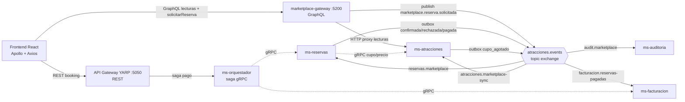

# Auditoría técnica — GraphQL + RabbitMQ (proyecto Atracciones)

> **Autor:** Auditoría de arquitectura
> **Alcance:** Uso de GraphQL (marketplace-gateway + frontend) y RabbitMQ (Event Bus) en la arquitectura de microservicios.
> **Versión del análisis:** junio 2026
> **Destinatario:** equipo de desarrollo (para validar contra entorno local).

---

## 1. Resumen ejecutivo

El proyecto implementa una **arquitectura híbrida de doble vía** para las reservas, sin romper el contrato REST de Booking:

| Vía | Canal | Reserva | Tecnología |
|-----|-------|---------|------------|
| **A — REST legacy** | Booking externo / usuario autenticado | `POST /api/v2/reservas` → orquestador (saga gRPC síncrona) → **201** | REST + gRPC |
| **B — GraphQL + EvBus** | Frontend React (invitados, `VITE_USE_GRAPHQL=true`) | Mutation `solicitarReserva` → RabbitMQ → `ms-reservas` | GraphQL + RabbitMQ (async) |

**Conclusiones clave:**

- **GraphQL** está implementado como un **gateway de fachada (thin proxy)** con Hot Chocolate (`marketplace-gateway`, puerto `:5200`). Las queries de lectura **devuelven JSON crudo (`String`)** en vez de tipos GraphQL fuertes; solo `estadoReserva` y los `input` de mutación están tipados. No hay **subscriptions** (se usa polling).
- **RabbitMQ** está bien estructurado con un **Event Bus reutilizable** (`BuildingBlocks/EventBus`): exchange tipo *topic*, **patrón Outbox** transaccional, **idempotencia** por `event_id`, **dead-letter exchange (DLX)**, reconexión con *backoff* y *prefetch* = 1. Es una implementación sólida y cercana a estándares de industria.
- El **frontend** está **correctamente desacoplado**: capa de API centralizada (Axios con interceptores + Apollo Client), hooks que encapsulan estado y efectos, contexto de autenticación. Es una **SPA web responsive**, no una app móvil nativa.
- **Resiliencia destacable:** el frontend hace *fallback* automático de GraphQL a REST; el backend tolera que el broker esté caído (Outbox + arranque tolerante).
- **Riesgos principales:** GraphQL sin tipado real (se pierde introspección/selección de campos), *fallback* que silencia errores del gateway, doble vía de escritura, y `EvBus__Enabled` desactivado por defecto en la documentación de Railway.

---

## 2. Implementación de GraphQL

### 2.1. Ubicación y stack

| Componente | Ruta | Detalle |
|------------|------|---------|
| Servidor GraphQL | `platform/marketplace-gateway/` | Hot Chocolate 15 (.NET) |
| Bootstrap | `platform/marketplace-gateway/Program.cs` | `AddGraphQLServer().AddQueryType<Query>().AddMutationType<Mutation>()` |
| Schema | `platform/marketplace-gateway/GraphQL/MarketplaceSchema.cs` | `Query` + `Mutation` + tipos de payload/input |
| Proxies HTTP | `platform/marketplace-gateway/Services/BackendProxyServices.cs` | `AtraccionesProxyService`, `ReservasProxyService` |
| Publisher de eventos | `platform/marketplace-gateway/Services/MarketplaceReservaPublisher.cs` | Publica `marketplace.reserva.solicitada` |
| Cliente (frontend) | `frontend-atracciones/src/graphql/client.js` | Apollo Client + `QUERIES`/`MUTATIONS` |
| API GraphQL (frontend) | `frontend-atracciones/src/graphql/marketplaceApi.js` | Funciones de consulta y polling |
| Config / flag | `frontend-atracciones/src/config/graphqlUrl.js` | `getGraphqlUrl()`, `useGraphqlEnabled()` |

Endpoint: `app.MapGraphQL("/graphql")` + `GET /health`. CORS por configuración (`Cors__*`). Middleware que inyecta y propaga `X-Correlation-ID`.

### 2.2. Schema expuesto

**Queries** (`Query` en `MarketplaceSchema.cs`):

| Query | Parámetros | Retorno | Origen |
|-------|-----------|---------|--------|
| `atracciones` | `ciudad, tipo, subtipo, idioma, calificacionMin, disponible, ordenarPor, page, limit` | `String` (JSON crudo) | proxy → `GET /api/v2/atracciones` |
| `filtros` | `ciudad` | `String` (JSON) | proxy → `GET /api/v2/atracciones/filtros` |
| `atraccion` | `guid: UUID!` | `String` (JSON) | proxy → `GET /api/v2/atracciones/{guid}` |
| `horarios` | `atGuid: UUID!, disponibles` | `String` (JSON) | proxy → `.../horarios?disponibles=` |
| `tickets` | `atGuid: UUID!` | `String` (JSON) | proxy → `.../tickets` |
| `estadoReserva` | `seguimientoId: UUID!` | `EstadoReservaPayload` (**tipado**) | proxy → ms-reservas internal |

**Mutation:**

| Mutation | Input | Retorno | Efecto |
|----------|-------|---------|--------|
| `solicitarReserva` | `SolicitarReservaInput!` | `SolicitudReservaPayload` | Publica evento `marketplace.reserva.solicitada` y devuelve `EN_PROCESO` |

**Subscriptions:** *no existen*. El estado de la reserva se obtiene por **polling** (`graphqlEsperarConfirmacionReserva`: hasta 30 intentos cada 2 s).

### 2.3. Cliente frontend

`src/graphql/client.js`:
- `ApolloClient` con `InMemoryCache`.
- `authLink` añade `Authorization: Bearer <token>` (desde `localStorage`) y `X-Correlation-ID` por request.
- Todas las queries usan `fetchPolicy: 'network-only'` (la caché de Apollo queda efectivamente sin uso).
- Las respuestas (JSON string) se parsean con `parseGraphqlJson()`.

Activación condicional: `useGraphqlEnabled()` lee `VITE_USE_GRAPHQL`; `getGraphqlUrl()` lee `VITE_GRAPHQL_URL`.

### 2.4. Patrón de *fallback* (resiliencia)

En `useAtracciones`, `useHomeDestacadas`, `useHorariosConPolling`:

```js
async function intentarGraphqlConFallback(graphqlFn, restFn) {
  try { return await graphqlFn() }
  catch { return await restFn() }   // si GraphQL falla → REST equivalente
}
```

Garantiza que el catálogo funcione aunque el `marketplace-gateway` esté mal configurado o caído.

---

## 3. Implementación de RabbitMQ (Event Bus)

### 3.1. Bloques compartidos (`BuildingBlocks/EventBus`)

| Pieza | Ruta | Función |
|-------|------|---------|
| Opciones | `Options/RabbitMqOptions.cs` | `Host, Port, VirtualHost, Username, Password`; `EvBusOptions.Enabled` |
| Conexión | `RabbitMq/RabbitMqPublisher.cs` → `RabbitMqConnectionHolder` | Conexión *singleton* con `GetConnection()` / `TryGetConnection()` (tolerante) |
| Publisher | `RabbitMq/RabbitMqPublisher.cs` | `IRabbitMqPublisher.Publish(routingKey, json, correlationId)` (mensajes **persistentes**) |
| Consumer base | `RabbitMq/RabbitMqConsumerHostedService.cs` | `BackgroundService` abstracto: QoS=1, ack manual, idempotencia, *backoff* |
| Topología | `RabbitMq/RabbitMqTopologyInitializer.cs` | Declara exchange, DLX, colas y *bindings* al arranque |
| Outbox | `Outbox/OutboxProcessorHostedService.cs` + `IOutboxStore.cs` | Publica eventos pendientes cada 2 s y los marca publicados |
| Registro DI | `Extensions/EventBusServiceCollectionExtensions.cs` | `AddAtraccionesEventBus()` |
| Sobre de evento | `Contracts.Events/EventEnvelope.cs` | JSON *snake_case* con `event_id, event_type, timestamp, correlation_id, payload` |
| Constantes | `Contracts.Events/EventTypes.cs` | Nombres de exchange, colas y *routing keys* |

### 3.2. Topología (exchange / colas / bindings)

- **Exchange:** `atracciones.events` — tipo **topic**, *durable*.
- **DLX:** `atracciones.dlx` — *fanout*; cola `atracciones.dlq` ligada. Todas las colas usan `x-dead-letter-exchange`.
- **Virtual host:** `atracciones`.

| Cola | Binding key | Servicio consumidor |
|------|-------------|---------------------|
| `reservas.marketplace` | `marketplace.reserva.solicitada` | **ms-reservas** |
| `atracciones.marketplace-sync` | `marketplace.reserva.*` | **ms-atracciones** |
| `crm.marketplace-actividad` | `marketplace.reserva.confirmada` | **ms-reservas (CRM)** |
| `audit.marketplace` | `marketplace.#` | **ms-auditoria** |
| `facturacion.reservas-pagadas` | `reservas.reserva.pagada` | **ms-facturacion** |
| `atracciones.dlq` | (DLX *fanout*) | — (sin consumidor) |

### 3.3. Routing keys (eventos)

| Routing key | Productor | Payload |
|-------------|-----------|---------|
| `marketplace.reserva.solicitada` | marketplace-gateway | `MarketplaceReservaSolicitadaPayload` |
| `marketplace.reserva.confirmada` | ms-reservas (outbox) | `MarketplaceReservaConfirmadaPayload` |
| `marketplace.reserva.rechazada` | ms-reservas (outbox) | `MarketplaceReservaRechazadaPayload` |
| `reservas.reserva.pagada` | ms-reservas (outbox, *shadow*) | `ReservasReservaPagadaPayload` |
| `atracciones.horario.cupo_agotado` | ms-atracciones (outbox) | `{ hor_guid, at_guid }` |

### 3.4. Garantías de entrega y robustez

- **Outbox transaccional:** los productores escriben el evento en la tabla `OutboxEvents` **dentro de la misma transacción** que el cambio de estado (`SaveChangesAsync`). El `OutboxProcessorHostedService` lo publica después → no se pierden eventos si el broker está caído.
- **Idempotencia de consumo:** `RabbitMqConsumerHostedService` extrae `event_id`/`event_type` del sobre y usa `IProcessedEventStore.TryMarkProcessedAsync()`; si ya se procesó, hace *ack* y descarta.
- **Idempotencia de negocio:** `CrearEnProcesoAsync` del seguimiento captura `DbUpdateException` (duplicado); la emisión de factura es idempotente por `rev_guid`.
- **Reintentos / DLQ:** ante excepción, `BasicNackAsync(requeue: false)` → el mensaje va al DLX/DLQ. *Backoff* de reconexión: `5, 10, 20, 30, 60` s.
- **Arranque tolerante:** si el broker no está disponible, el `TopologyInitializer` y los consumidores **no tumban el servicio**; reintentan.
- **Flag global:** todo el EvBus se activa con `EvBus:Enabled=true`. Si está en `false`, productores y consumidores quedan inertes.

---

## 4. Flujo de datos (descripción textual)

### 4.1. Reserva vía GraphQL + EvBus (invitado)

```
[Frontend React]
   │  mutation solicitarReserva(input)   (Apollo, Bearer + X-Correlation-ID)
   ▼
[marketplace-gateway : Mutation.SolicitarReserva]
   │  genera seguimientoId + revGuid
   │  PUBLISH  routingKey = "marketplace.reserva.solicitada"
   │           exchange   = "atracciones.events"
   │  return { estado: "EN_PROCESO", seguimientoId, revGuid }
   ▼
[RabbitMQ exchange topic "atracciones.events"]
   ├─► cola "reservas.marketplace"        (key: marketplace.reserva.solicitada)
   └─► cola "audit.marketplace"           (key: marketplace.#)
   ▼
[ms-reservas : MarketplaceReservaEventHandler.HandleSolicitadaAsync]
   │  1. Crea seguimiento EN_PROCESO (idempotente)
   │  2. Resuelve cli_guid (o crea cliente invitado)
   │  3. gRPC ms-atracciones: ObtenerHorarioParaReserva + GetTicketPrecio (por línea)
   │  4. gRPC ms-atracciones: ValidarYReservarCupo
   │       └─ si NO hay cupo → OUTBOX "marketplace.reserva.rechazada" + seguimiento RECHAZADA
   │  5. Crea reserva PENDIENTE
   │       └─ si falla → COMPENSA gRPC LiberarCupo + OUTBOX "marketplace.reserva.rechazada"
   │  6. Éxito → OUTBOX "marketplace.reserva.confirmada" + seguimiento CONFIRMADA
   ▼
[RabbitMQ] (vía Outbox processor)
   ├─► "atracciones.marketplace-sync"  (key: marketplace.reserva.*)
   │      └─ ms-atracciones: si confirmada y cupo=0 → OUTBOX "atracciones.horario.cupo_agotado"
   ├─► "crm.marketplace-actividad"     (key: marketplace.reserva.confirmada)
   └─► "audit.marketplace"             (key: marketplace.#)  → ms-auditoria registra evento

[Frontend React]  (en paralelo)
   │  query estadoReserva(seguimientoId)  cada 2s (máx 30 intentos)
   ▼
   └─ EN_PROCESO → CONFIRMADA | RECHAZADA
```

### 4.2. Pago / facturación (shadow EvBus)

```
[Frontend] POST /api/v2/reservas/{guid}/pagos/confirmacion   (REST, vía A — saga gRPC síncrona)
   ▼
[ms-reservas]  confirma pago (gRPC orquestador)  +  ReservaPagadaOutboxPublisher.TryEnqueueAsync()
   │  OUTBOX "reservas.reserva.pagada"   (best-effort, solo si EvBus habilitado y hay receptor)
   ▼
[RabbitMQ] ─► cola "facturacion.reservas-pagadas"
   ▼
[ms-facturacion : ReservaPagadaConsumerHostedService]
   └─ repo.EmitirAsync(...)  (idempotente por rev_guid)
```

> El pago sigue siendo **REST/gRPC síncrono** (no se tocó el contrato Booking). El evento `reservas.reserva.pagada` es un canal **shadow** para validar facturación por eventos antes de retirar la vía gRPC.

### 4.3. Estructura del mensaje (sobre)

```json
{
  "event_id": "f3c1...uuid",
  "event_type": "marketplace.reserva.solicitada",
  "timestamp": "2026-06-22T16:00:00Z",
  "correlation_id": "a1b2...uuid",
  "payload": { "seguimiento_id": "...", "rev_guid": "...", "at_guid": "...", "lineas": [ ... ] }
}
```

- `correlation_id` se propaga: header HTTP `X-Correlation-ID` → `BasicProperties.CorrelationId` (AMQP) → sobre → auditoría.
- `event_id` habilita la deduplicación idempotente del consumidor.

---

## 5. Buenas prácticas — frontend (programación "móvil"/web responsive)

> Nota: el cliente es una **SPA React responsive**, no una app móvil nativa. La evaluación aplica criterios de desacople, estado y centralización de red.

### 5.1. Desacople de lógica de negocio ✅

- **Capa de API aislada** en `src/api/*` (REST) y `src/graphql/*` (GraphQL). Los componentes no llaman a `fetch`/`axios` directamente.
- **Hooks** (`useAtracciones`, `useReserva`, `useMisReservas`, `usePerfilCliente`, `useHorariosConPolling`) encapsulan estado, efectos y orquestación.
- **Contexto de auth** (`AuthContext`) centraliza sesión, normalización de roles y expiración de JWT.

### 5.2. Manejo de estado ✅ (suficiente para el tamaño)

- Estado local con `useState`/`useMemo`/`useCallback` dentro de hooks; sin librería global (Redux/Zustand) — razonable para el alcance.
- `AuthContext` persiste en `localStorage` y valida expiración del token al montar.

### 5.3. Centralización de red ✅

- `apiClient` (Axios) con interceptores:
  - **Request:** inyecta `baseURL`, `Authorization: Bearer`, `X-Correlation-ID`.
  - **Response:** manejo global de `401` (logout + redirect), `403` (toast), `≥500` (toast), con **deduplicación de toasts**.
- Apollo Client centraliza GraphQL con su propio `authLink`.
- Configuración por entorno: `VITE_API_URL`, `VITE_GRAPHQL_URL`, `VITE_USE_GRAPHQL`.

### 5.4. Observaciones de mejora (frontend)

- **Duplicación token/correlation:** la lógica de `Bearer` + `X-Correlation-ID` está repetida en `apiClient` y en `client.js` (Apollo). Extraer a un helper común.
- **`fetchPolicy: 'network-only'`** anula la `InMemoryCache` de Apollo: o se aprovecha la caché o se usa un cliente HTTP más ligero.
- **`guidToUuid()`** en `marketplaceApi.js` es un *passthrough* (no transforma) → código muerto.
- El *fallback* GraphQL→REST **silencia el error** con `catch {}` vacío: conviene registrar/telemetrar para no ocultar caídas del gateway.

---

## 6. Evaluación frente a estándares de industria

| Aspecto | Estado | Comentario |
|---------|--------|------------|
| Exchange *topic* + *routing keys* jerárquicas | ✅ | Convención correcta (`dominio.entidad.accion`) |
| Patrón Outbox transaccional | ✅ | Evita pérdida de eventos (dual-write seguro) |
| Idempotencia de consumo | ✅ | Por `event_id` + store de procesados |
| Dead Letter Exchange | ⚠️ | Existe DLQ pero **sin consumidor/redrive ni alarma** |
| *Publisher confirms* | ⚠️ | No se usan; la fiabilidad recae en el Outbox |
| Reuso de canales AMQP | ⚠️ | `Publish` crea **un canal por mensaje** (coste bajo carga) |
| GraphQL tipado fuerte | ❌ | Queries devuelven `String` (JSON crudo); sin tipos ni selección de campos |
| GraphQL subscriptions | ❌ | Se usa polling en lugar de *push* para `estadoReserva` |
| Propagación de correlación | ✅ | HTTP → AMQP → auditoría |
| Trazas distribuidas (OTel) en bus | ⚠️ | OTel presente en gateway/orquestador; *pendiente* instrumentar publish/consume |
| Desacople frontend | ✅ | API + hooks + contexto |
| Configuración por entorno | ✅ | Variables `VITE_*` y `EvBus`/`RabbitMQ` |

---

## 7. Diagrama de flujo (resumen visual)



---

## 8. Checklist de validación (para auditar contra tu entorno local)

> Levanta el stack: `cd platform && docker compose up -d --build`.
> URLs: Gateway `:5050` · GraphQL `:5200/graphql` · RabbitMQ UI `:15672` (`atracciones`/`atracciones`) · Frontend `:5173`.

### 8.1. RabbitMQ

- [ ] La consola `http://localhost:15672` abre y el nodo está *running*.
- [ ] Existe el *virtual host* `atracciones`.
- [ ] Existe el exchange `atracciones.events` (topic, durable) y `atracciones.dlx` (fanout).
- [ ] Existen las 5 colas: `reservas.marketplace`, `atracciones.marketplace-sync`, `crm.marketplace-actividad`, `audit.marketplace`, `facturacion.reservas-pagadas` (+ `atracciones.dlq`).
- [ ] Cada cola tiene argumento `x-dead-letter-exchange = atracciones.dlx`.
- [ ] En los logs de cada servicio aparece `Topología RabbitMQ declarada...` y `Consumidor activo en cola ...`.
- [ ] `EvBus__Enabled=true` y variables `RabbitMQ__*` correctas en los 4 microservicios y el gateway.

### 8.2. GraphQL

- [ ] `http://localhost:5200/graphql` responde (Banana Cake Pop / playground).
- [ ] `query { atracciones(page:1, limit:6) }` devuelve JSON con `data` + `pagination`.
- [ ] `filtros`, `atraccion(guid)`, `horarios(atGuid)`, `tickets(atGuid)` responden.
- [ ] `mutation { solicitarReserva(input:{...}) { seguimientoId estado } }` devuelve `EN_PROCESO`.
- [ ] `query { estadoReserva(seguimientoId) { estado } }` pasa a `CONFIRMADA` en < 60 s.
- [ ] El header `X-Correlation-ID` se devuelve en la respuesta.

### 8.3. Flujo end-to-end

- [ ] Tras `solicitarReserva`, en RabbitMQ se ve 1 mensaje entrar/consumir en `reservas.marketplace`.
- [ ] `ms-reservas` crea el seguimiento y la reserva PENDIENTE; el estado pasa a CONFIRMADA.
- [ ] En `audit.marketplace`/`audit.eventos` queda registrado el evento.
- [ ] Confirmar pago REST → mensaje en `facturacion.reservas-pagadas` → factura emitida (idempotente).
- [ ] Sin cupo: el seguimiento queda `RECHAZADA` y se ejecuta compensación `LiberarCupo`.

### 8.4. No-regresión (obligatorio)

- [ ] `POST /api/v2/reservas` (autenticado) → **201** (saga gRPC, sin pasar por RabbitMQ).
- [ ] Panel `/admin/*` funciona por REST.
- [ ] Con `VITE_USE_GRAPHQL=false`, el frontend funciona 100 % por REST.
- [ ] Con el gateway GraphQL **apagado**, el catálogo sigue cargando (fallback REST).

### 8.5. Frontend

- [ ] DevTools → Network: con flag activo, el catálogo llama a `:5200/graphql`.
- [ ] Toda petición lleva `Authorization` (si hay sesión) y `X-Correlation-ID`.
- [ ] Un `401` desloguea y redirige a `/login`.

---

## 9. Discrepancias potenciales y puntos de mejora

### 9.1. Discrepancias frecuentes entre entornos (revisar primero)

1. **`EvBus__Enabled=false` en producción:** la doc `platform/docs/railway-env-vars.md` lo deja en `false` por defecto. Si en Railway no se activó, los consumidores/productores están inertes aunque el código exista → la reserva GraphQL queda en `EN_PROCESO` para siempre.
2. **Hostnames internos del gateway GraphQL:** `Services__AtraccionesHttp` / `Services__ReservasHttp` deben apuntar a `*.railway.internal:8080`. Si están mal, las queries GraphQL fallan (y el frontend cae a REST, ocultando el problema).
3. **Credenciales/host de RabbitMQ:** distintas entre Docker (`rabbitmq` / `atracciones`) y Railway (broker gestionado o CloudAMQP).
4. **`VITE_USE_GRAPHQL` / `VITE_GRAPHQL_URL`:** se inyectan como *build args* de Vite; si no se pasan en el build, el bundle queda con REST.

### 9.2. Mejoras de arquitectura (priorizadas)

| # | Mejora | Beneficio | Esfuerzo |
|---|--------|-----------|----------|
| 1 | **Tipar el schema GraphQL** (sustituir retornos `String` por *object types*) | Introspección, selección de campos, contrato fuerte | Medio |
| 2 | **Consumidor/redrive + alarma del DLQ** | Visibilidad de mensajes fallidos | Bajo |
| 3 | **Instrumentar OTel en publish/consume** del bus | Trazas end-to-end de la saga async | Medio |
| 4 | **Reusar canal/pool AMQP** en `RabbitMqPublisher` | Rendimiento bajo carga | Bajo |
| 5 | **Publisher confirms** (o documentar que el Outbox es la garantía) | Fiabilidad explícita | Bajo |
| 6 | **Subscriptions GraphQL** para `estadoReserva` | Push en vez de polling | Medio |
| 7 | **No silenciar el fallback GraphQL→REST** (telemetría/log) | Detectar caídas del gateway | Bajo |
| 8 | **Unificar auth/correlation** entre Axios y Apollo | Menos duplicación | Bajo |
| 9 | **Eliminar código muerto** (`guidToUuid`, caché Apollo sin uso) | Limpieza | Bajo |
| 10 | **Validar y retirar la vía gRPC de factura** tras shadow estable | Simplificar saga de pago | Medio |

### 9.3. Riesgos a vigilar

- **Doble vía de escritura** (REST saga vs GraphQL EvBus): mitigado porque el frontend fuerza REST para usuarios autenticados y GraphQL solo para invitados; mantener esa regla para evitar reservas duplicadas.
- **Consistencia eventual** en la vía B: el usuario ve `EN_PROCESO` hasta que el consumidor procesa; el polling tiene tope de 60 s.
- **Acoplamiento temporal** del handler de `ms-reservas` con gRPC de `ms-atracciones`: si inventario está caído, la solicitud se rechaza (con compensación). Vigilar *timeouts*.

---

## 10. Referencias de código

| Tema | Archivo |
|------|---------|
| Nombres de eventos/colas | `platform/shared/Contracts.Events/EventTypes.cs` |
| Sobre de evento | `platform/shared/Contracts.Events/EventEnvelope.cs` |
| Publisher / conexión | `platform/shared/BuildingBlocks/EventBus/RabbitMq/RabbitMqPublisher.cs` |
| Consumer base | `platform/shared/BuildingBlocks/EventBus/RabbitMq/RabbitMqConsumerHostedService.cs` |
| Topología | `platform/shared/BuildingBlocks/EventBus/RabbitMq/RabbitMqTopologyInitializer.cs` |
| Outbox | `platform/shared/BuildingBlocks/EventBus/Outbox/OutboxProcessorHostedService.cs` |
| Schema GraphQL | `platform/marketplace-gateway/GraphQL/MarketplaceSchema.cs` |
| Bootstrap GraphQL | `platform/marketplace-gateway/Program.cs` |
| Handler reserva (consumo) | `services/ms-reservas/.../EventBus/MarketplaceReservaEventHandler.cs` |
| Consumidor factura | `services/ms-facturacion/.../EventBus/ReservaPagadaConsumerHostedService.cs` |
| Consumidor auditoría | `services/ms-auditoria/.../EventBus/MarketplaceAuditoriaConsumerHostedService.cs` |
| Sync inventario | `services/ms-atracciones/.../EventBus/MarketplaceInventarioSyncHandler.cs` |
| Cliente GraphQL (FE) | `frontend-atracciones/src/graphql/client.js` |
| API GraphQL (FE) | `frontend-atracciones/src/graphql/marketplaceApi.js` |
| Cliente REST (FE) | `frontend-atracciones/src/api/atraccionesApi.js` |
| Docs previas | `docs/marketplace-graphql-evbus.md`, `platform/docs/evbus-graphql-verificacion.md`, `platform/docs/railway-env-vars.md` |

---

*Documento generado a partir del análisis directo del código fuente del repositorio. Para reproducir la validación, seguir el checklist de la sección 8 con el stack de `platform/docker-compose.yml` levantado.*
