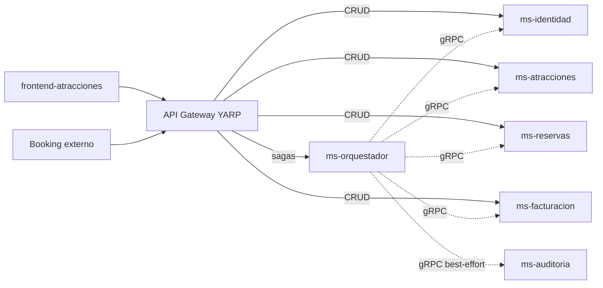
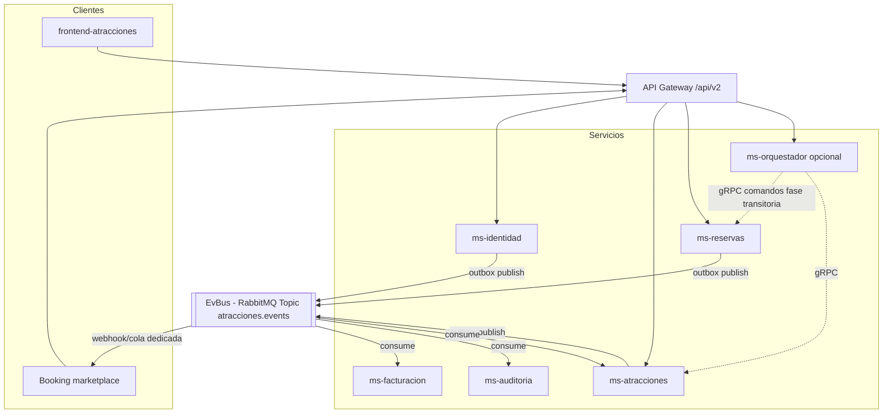
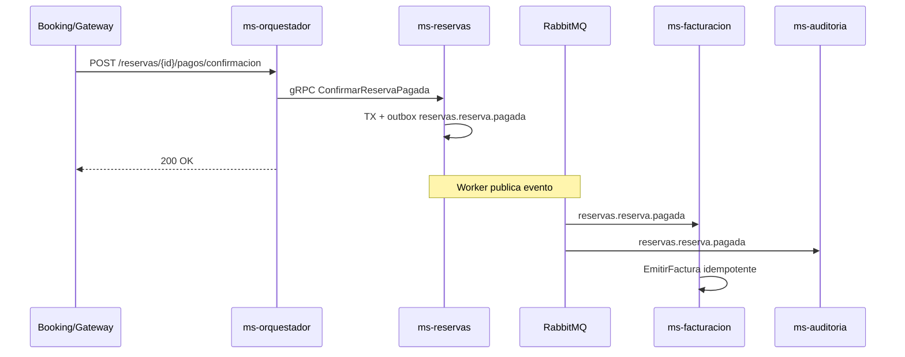

# Migración ESB → Event Bus (EvBus) — Sistema Atracciones

Documento de referencia para fundamentos teóricos, criterios técnicos, mejores prácticas y diseño EvBus orientado al **marketplace Booking** (integración externa vía API Gateway).

**Alcance del análisis:** monorepo `Atracciones` (`frontend-atracciones`, `platform/`, `services/`, `MicroservicioAtracionesAPI/`). El workspace habitual es solo el frontend, pero la arquitectura de integración vive en el repositorio padre.

**Referencias internas:**

- [AGENTS.md](../AGENTS.md) — plan implementado (gRPC + orquestador; **Fase 8** EvBus híbrido)
- [marketplace-graphql-evbus.md](marketplace-graphql-evbus.md) — estado de implementación GraphQL + RabbitMQ
- [MicroservicioAtracionesAPI/docs/arquitectura_microservicios.md](../MicroservicioAtracionesAPI/docs/arquitectura_microservicios.md) — visión event-driven con RabbitMQ
- [docs/api/Endpoints-Booking-Atracciones.md](api/Endpoints-Booking-Atracciones.md) — contrato marketplace Booking
- [platform/README.md](../platform/README.md) — gateway y desarrollo local

---

## 1. Estado actual del proyecto

| Capa | Ubicación | Rol en integración |
|------|-----------|-------------------|
| **Frontend** | `frontend-atracciones/` | React + Vite; **REST** al gateway (`VITE_API_URL`) y opcionalmente **GraphQL** al marketplace-gateway (`VITE_GRAPHQL_URL`, flag `VITE_USE_GRAPHQL`). Reservas async vía mutation + polling; pago sigue REST. |
| **API Gateway** | `platform/gateway/` | YARP: CRUD directo a microservicios; sagas (`/reservas/**`, registro) → `ms-orquestador`. |
| **Orquestador** | `services/ms-orquestador/` | Sagas **síncronas gRPC** (`CREAR_RESERVA`, `CONFIRMAR_PAGO`, etc.) + BD `saga_state` / `idempotency_keys`. |
| **Microservicios** | `ms-identidad`, `ms-atracciones`, `ms-reservas`, `ms-facturacion`, `ms-auditoria` | gRPC para el orquestador; REST para gateway/frontend. |
| **Monolito legacy** | `MicroservicioAtracionesAPI/` | Antes actuaba como **ESB implícito** (un `DbContext`, JOINs cross-BC, servicios como `ReservaPublicService`). Ya no debe enrutarse desde el gateway en el diseño objetivo. |
| **Documentación event-driven** | `arquitectura_microservicios.md` | Define **RabbitMQ**, Topic Exchange, Outbox, consumidores y catálogo de eventos. |
| **Marketplace Gateway** | `platform/marketplace-gateway/` | Hot Chocolate :5200 — lecturas catálogo + mutation reserva async (RabbitMQ). |
| **EvBus (RabbitMQ)** | `platform/shared/BuildingBlocks/EventBus/` | Topic `atracciones.events`; outbox en ms-reservas/ms-atracciones; consumidores en reservas, atracciones, auditoría, facturación. Flag `EvBus:Enabled`. |
| **Implementación acordada** | `AGENTS.md` Fases 0–7 + **Fase 8** | Saga gRPC **intacta** para Booking REST; EvBus **paralelo** para frontend marketplace GraphQL. |

**Conclusión:** modelo **híbrido** — Booking y admin siguen en saga síncrona REST; el frontend público puede usar GraphQL + eventos sin romper `/api/v2`. Detalle en [marketplace-graphql-evbus.md](marketplace-graphql-evbus.md).

---

## 2. Fundamentos teóricos

### 2.1 ESB (Enterprise Service Bus) — qué era aquí

Un ESB centraliza **ruteo, transformación, mediación y a veces orquestación** entre sistemas, con acoplamiento al hub central.

En Atracciones, el **monolito** cumplía funciones de ESB de facto:

- Un solo proceso y una BD `atracciones` con **FKs entre bounded contexts** (cliente↔usuario, reserva↔horario, factura↔reserva, etc.).
- Servicios de aplicación cross-context (`ReservaPublicService`, `ReseniaPublicService`, `FacturaPublicService`) que coordinaban varios repositorios en una misma transacción.
- El frontend llamaba un único backend; hoy llama al **gateway**, que concentra el punto de entrada (rol tipo ESB perimetral, sin lógica de negocio pesada).

**Problemas del ESB/monolito:** despliegue acoplado, escalado uniforme, riesgo de “base de datos compartida como integración”, y cambios en un BC que impactan a todos.

### 2.2 Event Bus (EB / EvBus) — qué aporta

Arquitectura **orientada a eventos**: los servicios publican **hechos de dominio** (`reservas.reserva.creada`, `reservas.reserva.pagada`) y otros reaccionan sin conocer al emisor.

Beneficios típicos:

- **Desacoplamiento temporal** (el productor no espera a facturación, auditoría o Booking).
- **Escalabilidad independiente** por consumidor.
- **Extensibilidad del marketplace** (nuevos suscriptores sin tocar el productor).
- **Consistencia eventual** con compensaciones o sagas **coreografiadas**.

Costes: complejidad operativa (broker, colas, DLQ), idempotencia de consumidores, trazabilidad distribuida, versionado de esquemas de eventos.

### 2.3 Modelo híbrido implementado hoy (no es EB puro)

| Patrón | Uso en el repo |
|--------|----------------|
| **Orquestación síncrona (saga)** | `ms-orquestador` coordina pasos gRPC con compensación explícita. |
| **Coreografía por eventos** | **Parcial:** reserva marketplace GraphQL, auditoría async, facturación async (shadow); saga REST sin cambios. |
| **API Gateway / BFF** | YARP; contrato marketplace Booking en `/api/v2`. |
| **Integración síncrona punto a punto** | gRPC orquestador → MS; catálogo + inventario **in-process** en `ms-atracciones`. |

### 2.4 Marketplace (Booking externo)

El “marketplace” en este proyecto es el **ecosistema Booking externo** que consume el contrato público v2:

- Base: API Gateway `/api/v2` — ver [Endpoints-Booking-Atracciones.md](api/Endpoints-Booking-Atracciones.md).
- 10 endpoints de catálogo + reservas + confirmación de pago.
- Convenciones: envelope, `Idempotency-Key`, `X-Correlation-ID`, estados `PENDIENTE` / `PAGADA` / `CANCELADA`.
- Integración **asíncrona prevista** en la doc de arquitectura: webhooks o colas RabbitMQ para eventos como `atracciones.horario.cupo_agotado` o confirmación de reserva — **aún no cableado en código**.

El **frontend** (`frontend-atracciones`) es otro cliente del mismo gateway; no requiere RabbitMQ si el contrato REST se mantiene estable.

---

## 3. Criterios técnicos para migrar ESB → EvBus (marketplace)

### 3.1 Criterios de arquitectura

1. **Un bounded context = una BD** (ya aplicado): sin FK entre servicios; solo GUIDs débiles.
2. **Contrato de eventos versionado**: naming `dominio.entidad.verbo` (ej. `reservas.reserva.pagada`); campos nuevos opcionales; breaking → sufijo `v2`.
3. **Outbox transaccional** por MS que publica: misma transacción que persiste entidad + fila en `outbox_events`; worker publica a RabbitMQ.
4. **Exchange Topic** (`atracciones.events`) y routing keys por dominio (`reservas.reserva.*`).
5. **Idempotencia de consumo**: tabla `eventos_procesados` por `event_id`.
6. **Correlación end-to-end**: `X-Correlation-ID` (HTTP) = `correlation_id` en metadata de mensajes.
7. **Gateway REST estable para marketplace**: los 10 endpoints Booking no deben exponer el bus; el bus es **interno / B2B opcional**.

### 3.2 Criterios de negocio / marketplace

| Flujo | Criterio de aceptación |
|-------|------------------------|
| Catálogo | Booking sigue usando GET `/atracciones`, horarios, tickets sin cambio de URL. |
| Crear reserva | `POST /reservas` responde con estado coherente; evento `reservas.reserva.creada` publicado **después** de commit (outbox). |
| Pago | `POST .../pagos/confirmacion` idempotente; evento `reservas.reserva.pagada` dispara facturación **asíncrona** si se migra a EB. |
| Cupos | Hoy: `ValidarYReservarCupo` síncrono vía orquestador; con EB: publicar consumo en `ms-atracciones` o mantener reserva síncrona + evento solo para notificaciones. |
| Auditoría | Hoy: gRPC best-effort; con EB: `ms-auditoria` consume por routing key o wildcard. |

### 3.3 Criterios operativos (RabbitMQ)

- Alta disponibilidad del cluster (o servicio gestionado).
- Colas por consumidor con **DLQ** y política de reintentos.
- TLS y credenciales por vhost (no en `appsettings` versionados).
- Observabilidad: trazas que enlacen HTTP → publicación → consumo (OpenTelemetry + Jaeger en `platform/`).

### 3.4 Criterios de no-regresión

- Mantener **contrato OpenAPI v2** para frontend y Booking.
- No romper `Idempotency-Key` en orquestador hasta migrar esas operaciones a comando + evento.
- Definir si `ms-orquestador` **permanece** (híbrido: saga síncrona + publicación outbox) o se reduce a API de comandos.

---

## 4. Mejores prácticas de migración

### 4.1 Estrategia: Strangler Fig (ya en curso)

Documentado en [AGENTS.md](../AGENTS.md) (fases 0–7). Para añadir EvBus:

1. **No sustituir de golpe** el orquestador por eventos en flujos críticos (reserva + pago).
2. **Introducir el bus en lecturas reactivas primero**: auditoría, notificaciones, sincronización Booking de cupos agotados.
3. **Migrar escrituras transaccionales** con outbox servicio a servicio.
4. **Apagar publicación duplicada** (mismo hecho por gRPC y por evento) solo cuando el consumidor esté probado.

### 4.2 Patrones recomendados

| Práctica | Aplicación en Atracciones |
|----------|---------------------------|
| **Transactional Outbox** | En `ms-reservas` al crear/confirmar reserva; en `ms-identidad` al registrar usuario. |
| **Saga orquestada → coreografiada** | Fase 1: orquestador publica eventos tras pasos gRPC; Fase 2: facturación solo consume `reservas.reserva.pagada`. |
| **Anti-corruption layer** | Adaptadores de eventos Booking ↔ esquema interno de payload. |
| **Schema registry / contrato JSON** | Carpeta compartida de eventos junto a `platform/shared/Contracts.Protos`. |
| **Dead-letter + replay** | Obligatorio antes de producción marketplace. |
| **Feature flags** | Publicar a RabbitMQ en shadow mode sin consumidores productivos. |

### 4.3 Anti-patrones a evitar

- Publicar a RabbitMQ **sin** outbox (pérdida de mensajes si falla el broker tras commit BD).
- Consumir eventos **sin** idempotencia (`event_id`).
- Exponer RabbitMQ directamente al partner Booking (usar gateway REST + webhooks/cola dedicada).
- Duplicar lógica de cupos en evento y en gRPC sin una sola fuente de verdad.

---

## 5. Microservicios a actualizar para EvBus + marketplace

### 5.1 Impacto por servicio

| Microservicio | Estado actual | Cambios para EvBus + marketplace |
|---------------|---------------|----------------------------------|
| **ms-orquestador** | Saga gRPC + REST Booking | Añadir publicador outbox post-paso o delegar solo comandos; mantener compensaciones síncronas hasta validar coreografía. |
| **ms-reservas** | CRM + ventas; gRPC `ReservaService` / `ClienteService` | Outbox en crear/confirmar reserva; consumir `identidad.usuario.registrado` si el registro deja de ser 100% orquestado. |
| **ms-atracciones** | Inventario + catálogo in-process | Publicar `atracciones.horario.cupo_agotado`; consumir `reservas.reserva.creada` solo si cupos pasan a asíncrono. |
| **ms-identidad** | JWT, login, gRPC usuario | Publicar `identidad.usuario.registrado` vía outbox. |
| **ms-facturacion** | `EmitirFactura` vía gRPC desde saga pago | Migrar a consumidor de `reservas.reserva.pagada`. |
| **ms-auditoria** | gRPC `RegistrarEvento` | Consumidor RabbitMQ; opcional retener gRPC en transición. |
| **platform/gateway** | REST estable | Sin RabbitMQ; B2B mTLS / client credentials (pendiente AGENTS.md Fase 7). |
| **frontend-atracciones** | REST | Sin cambios si `/api/v2` no cambia. |
| **Monolito** | Legacy | No integrar al bus; retirar sin fallback en gateway. |

### 5.2 Servicios fusionados

`ms-clientes` y `ms-catalogos` **no existen como procesos**; la lógica vive en `ms-reservas` y `ms-atracciones`. Los eventos de esos dominios deben emitirse desde el servicio fusionado correspondiente.

### 5.3 Contratos gRPC existentes

Protos en `platform/shared/Contracts.Protos/`: `usuario_service`, `cliente_service`, `reserva_service`, `atraccion_inventario_service`, `catalogo_service`, `factura_service`, `auditoria_service`. En migración EB, los comandos críticos pueden seguir en gRPC mientras los **hechos** pasan al bus.

---

## 6. Diagramas de arquitectura

### 6.1 Arquitectura actual (implementada)



### 6.2 Arquitectura objetivo EvBus



### 6.3 Flujo: confirmación de pago (target event-driven)



---

## 7. RabbitMQ — diseño técnico

Basado en `arquitectura_microservicios.md` §3:

| Elemento | Recomendación |
|----------|----------------|
| **Exchange** | `topic`, nombre `atracciones.events` |
| **Routing keys** | `identidad.usuario.registrado`, `reservas.reserva.creada`, `reservas.reserva.pagada`, `facturacion.factura.emitida`, `atracciones.horario.cupo_agotado` |
| **Colas** | Una cola por consumidor con binding según caso (`reservas.reserva.*`, etc.) |
| **Outbox** | Tabla `outbox_events` por MS; worker (MassTransit o hosted service .NET) |
| **Infra local** | Añadir servicio `rabbitmq` en `platform/docker-compose.yml` (hoy ausente) |
| **Payload mínimo** | `event_id`, `event_type`, `timestamp`, `correlation_id`, `payload` (JSON) |
| **DLQ** | Cola dead-letter por binding; alertas en OTel |

**Nota:** [AGENTS.md](../AGENTS.md) §10 indica que RabbitMQ, MassTransit y outbox fueron **eliminados** del plan implementado a favor de gRPC. Reintroducirlos requiere **decisión de arquitectura explícita**.

### Ejemplo de evento (`reservas.reserva.creada`)

```json
{
  "event_id": "123e4567-e89b-12d3-a456-426614174000",
  "event_type": "reservas.reserva.creada",
  "timestamp": "2025-07-01T14:30:00Z",
  "correlation_id": "abc-123",
  "payload": {
    "rev_guid": "...",
    "cli_guid": "...",
    "total": 150.00,
    "detalles": [
      { "hor_guid": "...", "cantidad": 2 }
    ]
  }
}
```

---

## 8. Rol del frontend

| Archivo / área | Integración actual |
|----------------|-------------------|
| `src/config/apiBaseUrl.js` | Gateway `:5050` local o Railway en prod |
| `src/api/atraccionesApi.js` | `X-Correlation-ID` automático |
| `src/api/reservasApi.js` | `Idempotency-Key` en POST reserva y confirmación pago |
| `src/api/*` | auth, atracciones, reservas, facturas, reseñas, clientes, admin |

Para EvBus marketplace: el frontend **no se conecta al bus**. Solo validar que los eventos internos no cambien el contrato REST en [openapi-v2-booking-public.md](../MicroservicioAtracionesAPI/docs/api/openapi-v2-booking-public.md).

---

## 9. Roadmap sugerido

| Fase | Entregable |
|------|------------|
| **0** | ✅ RabbitMQ en Compose + outbox en BuildingBlocks |
| **1** | ✅ ms-reservas/atricciones/auditoría/facturación + marketplace-gateway GraphQL |
| **2** | `ms-identidad` publica `identidad.usuario.registrado`; `ms-reservas` consume |
| **3** | ✅ ms-facturacion consume `reservas.reserva.pagada` (shadow; gRPC saga activo) |
| **4** | Notificaciones marketplace: webhook/cola para Booking |
| **5** | Evaluar cupos asíncronos en `ms-atracciones` |
| **6** | Apagar monolito; cerrar fallback gateway ([plan-fusion-microservicios.md](plan-fusion-microservicios.md)) |

---

## 10. Decisiones pendientes (checklist)

1. **¿Híbrido o bus puro?** ¿Mantener `ms-orquestador` con gRPC para reserva/pago y RabbitMQ solo para efectos secundarios?
2. **¿Cupos síncronos o por evento?** Booking exige respuesta inmediata en `POST /reservas`.
3. **¿MassTransit u otro cliente?** No hay dependencias actuales en `services/`.
4. **¿Contrato de eventos compartido?** Ej. `platform/shared/Contracts.Events`.
5. **¿B2B?** mTLS / client credentials en gateway para Booking.

---

## 11. Resumen ejecutivo

| Tema | Respuesta |
|------|-----------|
| **Fundamentos** | ESB ≈ monolito acoplado; EvBus = desacoplamiento por eventos; hoy: **saga orquestada gRPC**. |
| **Criterios técnicos** | BC + BD por servicio, outbox, idempotencia, correlación, `/api/v2` estable. |
| **Mejores prácticas** | Strangler Fig, outbox primero, consumidores idempotentes. |
| **Microservicios** | Orquestador, reservas, atracciones, identidad, facturación, auditoría; gateway y frontend REST casi sin cambios. |
| **RabbitMQ** | Desplegado en `platform/docker-compose.yml`; BuildingBlocks + ms-reservas/atricciones/auditoría/facturación. |
| **Marketplace** | Booking vía gateway REST; frontend React vía GraphQL + EvBus (vía B). Webhooks Booking = pendiente. |

---

*Generado a partir del análisis del repositorio Atracciones y requisitos de migración ESB → Event Bus (marketplace).*
