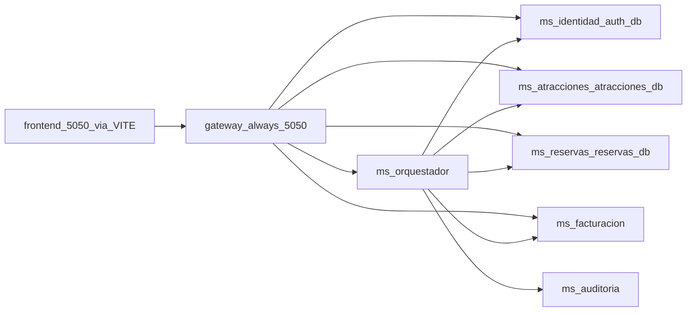

# Plan de fusión microservicios y bases (actualizado sin monólito)

## Restricciones que bloquean el arranque “antiguo”

1. **No dependencia del monolito**: el sistema no debe enrutar ni sincronizar hacia [`MicroservicioAtracionesAPI`](MicroservicioAtracionesAPI/Microservicio.Atracciones.Api). Todas las peticiones públicas/admin que hoy pueden caer en el **catch‑all del monólito** en [`platform/gateway/appsettings.json`](platform/gateway/appsettings.json) (`monolith-api`, `monolith-swagger`, `monolith-root`, clúster `Address: localhost:5031`) deben desaparecer o redirigirse a microservicios concretos antes de ejecutar cualquier fusión BD.
2. **Gateway solo en puerto host `5050`**: debe ser la única URL documentada para el frontend y para desarrollo local con Docker Compose (mapeo `5050:8080` ya en [`platform/docker-compose.yml`](platform/docker-compose.yml)). En ejecución con `dotnet run` sin Docker, [`platform/gateway/Properties/launchSettings.json`](platform/gateway/Properties/launchSettings.json) debe usar **`applicationUrl`: `http://localhost:5050`** (actualmente `:5000`, inconsistente).
3. **Migración completa de rutas**: ningún `ReverseProxy__Clusters__monolith*` en Compose ni en secretos locales; cualquier función que antes vivía solo en monólito debe existir en el servicio dueño antes de cerrar las rutas.

---

## Inventario rápido: rutas hoy típicamente “legacy” (monólito)

Rutas con controladores aún solo en [`Microservicio.Atracciones.Api`](MicroservicioAtracionesAPI/Microservicio.Atracciones.Api/Controllers):

| Prefijo REST | Migración objetivo típica |
|--------------|---------------------------|
| `/api/v1/auth/*` (excepto login ya en identidad/registro ya en orquestador) | Consolidar comportamiento donde corresponda; **sin llamadas HTTP al monólito desde gateway** |
| `/api/v1/admin/usuarios` | **`ms-identidad`** (gestión usuarios/auth) |
| `/api/v1/atracciones/{guid}/resenias` (público) | **`ms-atracciones`** — **hecho** |
| `/api/v1/resenias` (plano, monolito) | **Obsoleto**; no enrutar en gateway |
| `/api/v1/admin/resenias` | **`ms-atracciones`** (pendiente portar admin CRUD) |
| Rutas `/api/v1/admin/destinos|…` | Ya suelen estar en **`ms-catalogos`** vía gateway; tras fusión **`ms-atracciones`** |
| `/internal/v1/catalogos/mirror` | Obsoleto o reemplazar por proceso de migración datos (ETL/deploy), sin monólito receptor |

Las rutas que el gateway ya enruta a microservicios (atracciones, tickets, catálogo admin, clientes, reservas saga, facturas…) se mantienen; el trabajo crítico es **cerrar el fallback** (`Order = 10` monolith).

---

## Objetivo de datos (sin cambiar respecto a lo acordado)

| BD | Tablas dominantes | Servicio propietario |
|----|-------------------|----------------------|
| `auth_db` | usuario, roles, usuario×roles | `ms-identidad` |
| `atracciones_db` | catálogo + inventario + reseña (lista que diste: destino… resenia) | `ms-atracciones` (+ absorbe `ms-catalogos`) |
| `reservas_db` | clientes, reservas, reserva_detalle | `ms-reservas` (+ absorbe `ms-clientes`) |
| `facturacion_db` | facturas, datos_facturacion | `ms-facturacion` |

`ms-orquestador` y `ms-auditoria` siguen como hoy conceptualmente.

---

## Fases de trabajo

### Fase 0 — Corte de gateway y frontend (prioridad alta, antes que BD)

- Eliminar rutas/clúster `monolith` en [`appsettings.json`](platform/gateway/appsettings.json).
- En [`docker-compose.yml`](platform/docker-compose.yml), quitar variables `ReverseProxy__Clusters__monolith__*` (líneas que apuntan a `host.docker.internal:5031`).
- Alinear **perfil VS/dotnet** del gateway con **5050** y documentar solo `http://localhost:5050/api/v1` para [`frontend-atracciones/.env.example`](frontend-atracciones/.env.example) y `.env.local`.
- Hasta que una ruta tenga backend real, mejor **respuesta explícita 501/404 desde un servicio** que un fallback oculto al monólito.

### Fase A — Migración funcional rutas pendientes por servicio

- **Usuario admin CRUD**, si el producto lo exige: portar desde [`UsuariosController.cs`](MicroservicioAtracionesAPI/Microservicio.Atracciones.Api/Controllers/V1/Internal/UsuariosController.cs) a **`ms-identidad`** y añadir rutas gateway `Order` inferior al fallback (que ya no existirá).
- **Reseñas públicas**: **hecho** en `ms-atracciones` (`GET/POST /api/v1/atracciones/{guid}/resenias`). Monolito [`ReseniasController.cs`](MicroservicioAtracionesAPI/Microservicio.Atracciones.Api/Controllers/V1/Internal/ReseniasController.cs) marcado obsoleto; sin ruta gateway.
- **Reseñas admin**: portar [`ReseniasAdminController.cs`](MicroservicioAtracionesAPI/Microservicio.Atracciones.Api/Controllers/V1/Internal/ReseniasAdminController.cs) a **`ms-atracciones`**.
- **Reservas Booking**: orquestador expone `POST /reservas` (pendiente+cupo), `POST /reservas/{guid}/pagos/confirmacion`, PayPal auxiliar `POST /pagos/paypal/orders`. Ver [`openapi-v2-booking-public.md`](../MicroservicioAtracionesAPI/docs/api/openapi-v2-booking-public.md).
- **Auth/registro**: confirmar que `POST /api/v1/auth/registro` sólo **`ms-orquestador`** → identidad/cliente(s) eventualmente fusionado; ningún código en gateway hacia puerto legacy.
- Revisión **openapi**/`docs/api/` frente al monólito vs microservicios para no dejar rutas huérfanas.

### Fase B — Fusión `ms-clientes` dentro de `ms-reservas` (BD única `reservas_db`)

- Unificar `DbContext` con tablas clientes + reserva + detalle; **gRPC**: mantener **`ClienteService` + `ReservaService`** en el mismo proceso (misma app, mismo puerto gRPC si aplica).
- Orquestador: `GrpcClients:Clientes` → host de **`ms-reservas`** únicamente.
- Gateway: `/api/v1/clientes/{**catch-all}` → mismo host que ms-reservas (resto igual).
- Retirar contenedor/proj `ms-clientes` y Postgres `crm` cuando ETL OK.

### Fase C — Fusión `ms-catalogos` dentro de `ms-atracciones` (BD única `atracciones_db`)

- Incorporar entidades/migraciones de catálogo; quitar cliente `CatalogGrpc` de [`appsettings`](services/ms-atracciones/src/Atracciones.MsAtracciones.Api/appsettings.Development.json).
- Registrar **`CatalogoService` gRPC** en el proceso **`ms-atracciones`**.
- Rutas `/api/v1/admin/destinos|…` siguen igual en path pero clusters YARP solo `atracciones`.
- Eliminar **`MonolithCatalogLegacy`**/`CatalogMirrorIngress` dirigidos al monólito — sustituir por **solo ETL inicial** entre entornos o por flujo admin contra el servicio único.

### Fase D — Rename BD y Compose

- Ajustar nombres lógicos `auth_db`, `atracciones_db`, `reservas_db`, `facturacion_db` en cadenas y contenedores.
- Scripts ETL idempotentes entre esquemas viejos y nuevos (ya hay plantillas en `services/*/db/`).

### Fase E — QA “sin monólito”

- Tabla smoke: cada endpoint público que listaste + `PUT /api/v1/reservas/{guid}/cancelar` + cliente admin habitual.
- Observabilidad: trazas orquestador → servicios fusionados sin hop monólito.

---

## Diagrama objetivo actualizado

No existe ruta desde `GW` ni `ORQ` hacia legacy.

---

## Checklist ejecutable antes de declarar terminado

- [x] Gateway: sin rutas/cluster `monolith` en [`appsettings.json`](../platform/gateway/appsettings.json) (reservas → orquestador, atracciones → ms-atracciones).
- [ ] Kestrel gateway accesible en **5050** (Compose + `dotnet run` alineados).
- [ ] Frontend: `.env*` solo `VITE_API_URL=http://localhost:5050/api/v1`.
- [ ] Todas las URLs `5031`, `ReverseProxy`**monolith**, `CatalogMirror`/sync al monólito eliminadas o desactivadas.
- [ ] Fusión BD/cliente+catálogo según fases anteriores del plan maestro.
- [ ] Swagger/descubrimiento: opcional Swagger por microservicio o documentación agrupada fuera del monólito — **no dependencia de `/swagger` del monólito vía gateway**.

---

## Referencia histórica (plan fusión inicial)

Este documento **sustituye y amplía** el plan anterior (fusión cliente↔reservas, catálogo↔atracciones) con las políticas nuevas **sin monólito** y **puerto gateway fijo 5050**.
